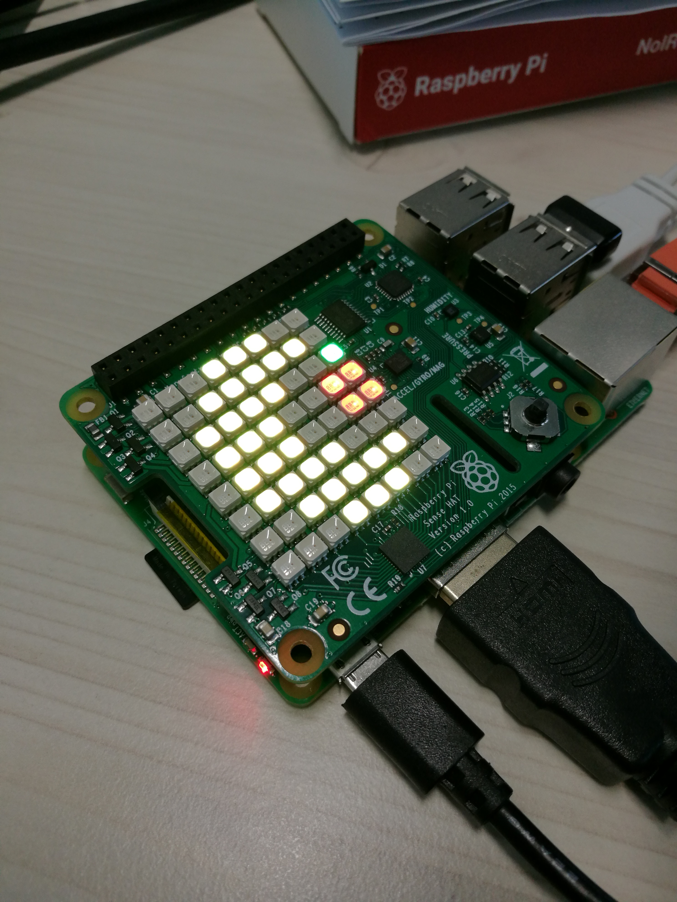

# SenseHat-PacMan

FR/ Ce code anime un pacman sur un sensehat ( Version 1.0 / Raspberry Pi 3  ) 

US/ This code animate a pacman on a sense hat ( 1.0 Version / Raspberry Pi 3 )

## Overview

Le Sense Hat est une carte Raspberry Pi composée de capteurs comme la temperature, humidité, pression, orientation ... etc

Cette carte comporte surtout un "ecran" led de 8 par 8 permettant l'affichage de texte , image et autre ...

Ces leds sont facilement programmables ( Changer la couleur , le sens de l'image/texte... )

Le code se trouve dans le document python "pacman.py" :

Ce code est composé en deux parties distinctes : 

  * La Première est "l'écriture" des images ( 4 au total dans ce code ) avec les differentes couleurs placé a des endroits precis ( Coordonnée 2-2 par exemple est un pixel jaune nommé "y" dans le code )

  * La seconde partie est une boucle affichant les images les unes après les autres, Ce qui rend cet effet d'animation ou de "gif"  

Enfin, si vous le souhaitez, vous pouvez très bien modifier la vitesse de l'animation en changeant le chiffre (en secondes) entres parentheses apres le "time.sleep" dans la boucle "while".

## Screenshots

